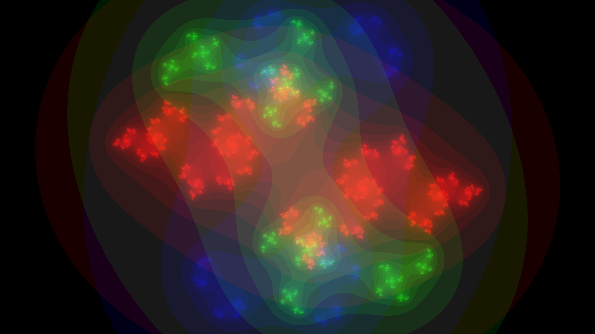
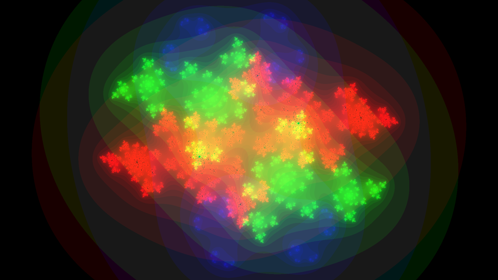
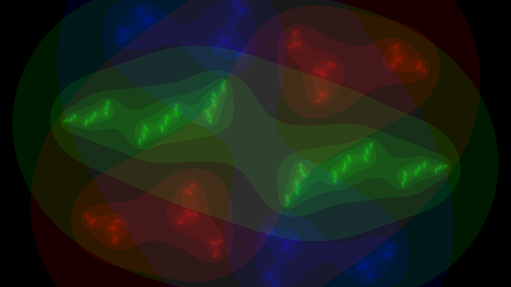
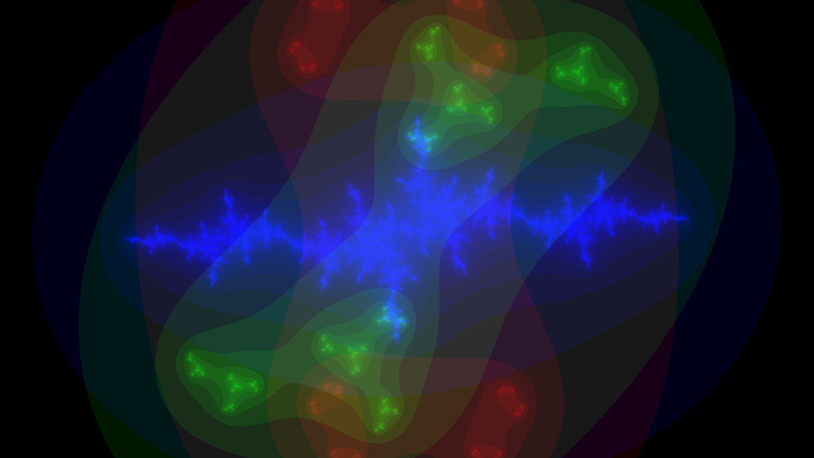

# Fractal background for linux using Julia

This small script creates a Julia fractal image combination and uses `feh` to
use the image as background.

This code uses the Julia language, so the Julia fractal is fitting.

## Prerequisites

```
julia> Pkg.add("Images")
```

and install `feh`.

## Run once

```
julia juliabg.jl
```

## Install

```
chmod a+x juliabg.jl
sudo cp juliabg.jl /usr/local/bin/juliabg
```

## Automatically change background using cron

Install and start cron (search your distribution).

```
crontab -e
* * * * * /usr/local/bin/juliabg
```

## License

Copyright © 2017 Abel Soares Siqueira

The code is licensed under the [GNU GPL v3](gpl.txt).
The images are released under the [Creative Commons CC-BY-SA](cc-by-sa.txt).


## Examples








